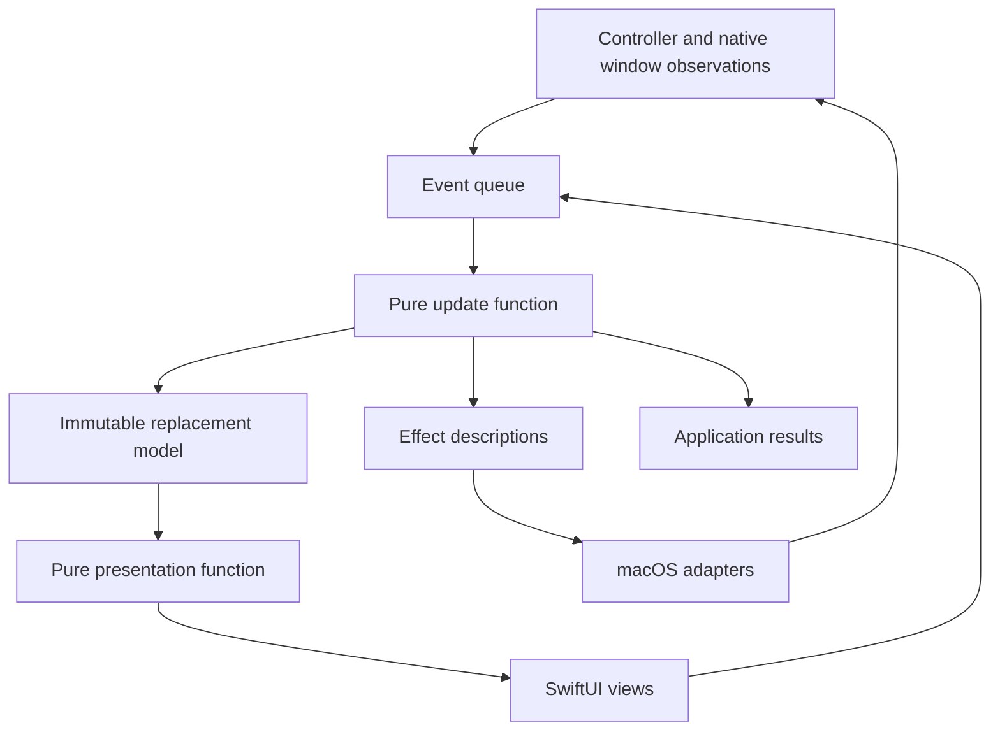

# Radial Menu Architecture

## Purpose and scope

Radial Menu is a macOS application for presenting a circular menu and operating
it with a game controller. Each selectable item occupies a sector around a
central area. The user points the left stick toward an item, moves between
items with the directional pad, and presses a button to select it. An item may
open another menu. The right stick moves the menu across the screen.

The project is a proof of concept intended to establish that this interaction
can be constructed and controlled reliably. It has no active users and no
migration or backward compatibility requirements. Existing code is optional;
implementation choices should follow this design and their demonstrated value.

This document describes the intended architecture. It is a specification for
implementation and verification, not a claim that the design has already been
implemented or that its platform behavior has been demonstrated.

The scope includes menu definitions, validation, geometry, selection, nested
navigation, controller input, window presentation, keyboard and pointer
alternatives, accessibility, and returning a selection to the application.

Executing the selected item is outside this scope. The menu returns a value; it
does not launch applications, run shell commands, simulate keystrokes, or execute
scripts. Persistent settings, menu editors, custom icon files, application
switching, Shortcuts, URL commands, and AppleScript interfaces require separate
designs if they are added later.

The application is proprietary to SAX Capital.

## Reading guide

- [User experience](#user-experience)
- [Architectural approach](#architectural-approach)
- [Modules and dependencies](#modules-and-dependencies)
- [Data and state ownership](#data-and-state-ownership)
- [Events, effects, and subscriptions](#events-effects-and-subscriptions)
- [Session lifecycle](#session-lifecycle)
- [Controller input](#controller-input)
- [Selection and navigation](#selection-and-navigation)
- [Geometry and movement](#geometry-and-movement)
- [SwiftUI and accessibility](#swiftui-and-accessibility)
- [Native window behavior](#native-window-behavior)
- [Concurrency and resource ownership](#concurrency-and-resource-ownership)
- [Results, failures, and diagnostics](#results-failures-and-diagnostics)
- [Verification](#verification)
- [Implementation sequence](#implementation-sequence)
- [Parameters requiring measurement](#parameters-requiring-measurement)

## User experience

The application runs as a menu bar application. A menu bar command provides an
opening mechanism even when no controller is connected. A supported controller
provides the primary interaction. The initial application uses an explicitly
constructed menu and displays the returned selection so that the complete
interaction can be exercised without an action execution system.

Only one menu interaction can be active at a time. This interaction is called a
session: it begins when an open request is accepted and ends with a selected
item, cancellation, or reported failure. Navigating into a submenu continues
the same session. A leaf item has no submenu and returns a value when selected.

| Control | Behavior |
| --- | --- |
| Controller Menu button | Open a menu, or cancel the current session. |
| Left stick | Select an item by direction. |
| Directional pad left/right | Select the previous/next item. |
| Confirm button | Enter a submenu or choose the selected leaf item. |
| Back button | Return to the parent menu, or cancel at the root. |
| Right stick | Move the menu across the connected displays. |
| Keyboard left/right | Select the previous/next item. |
| Return | Confirm the selected item. |
| Escape | Cancel the whole session. |
| Pointer movement | Select the sector under the pointer. |
| Primary click on a sector | Select and activate that item. |

Use controller capabilities and physical button positions to identify Confirm
and Back. Display the appropriate button labels for the connected device. Do
not assume that every controller exposes the same buttons or that a system
Home button is available for application use.

Opening and entering a submenu begin without a selected item. Confirmation
without a selection does nothing. A menu remains open until a leaf is selected,
the user cancels, focus is lost, the owning controller becomes unavailable, or
a failure prevents continued interaction. There is no inactivity timeout.

The panel takes focus while it is active. The application attempts to return
focus to the previous application when appropriate, without overriding a
subsequent user decision to switch applications.

## Architectural approach

Correctness, testability, clarity, and maintainability take precedence over
performance. The application uses the functional core / imperative shell
pattern:

- The **functional core** transforms immutable values. It decides how input
  changes the menu and describes any work needed from the operating system.
- The **imperative shell** owns windows, controller objects, timers, observers,
  and other resources. It performs the requested work and reports observations
  back as values.

A pure function returns the same result for the same arguments and has no
observable effects outside that calculation. Core functions must not read a
clock, generate random identifiers, query a device, access a file, log a
message, invoke an application callback, or modify shared state.

The user interface follows the Model, Update, and View arrangement described
by [The Elm Architecture](https://guide.elm-lang.org/architecture/). The model
contains application state. An update function computes a replacement model
from an event. A presentation function derives the values the view needs.

The central contracts are:

```text
update(model, event) -> replacement model, effects, outputs
present(model) -> render model
subscriptions(model) -> required event sources
```

Effects and subscriptions are data descriptions of work the shell performs.
This follows Elm's separation of application decisions from
[commands and subscriptions](https://guide.elm-lang.org/effects/). SwiftUI
provides rendering; a small Swift runtime provides event processing and effect
dispatch. A separate state-management framework is not required by this design.



All decisions follow this path. A view or adapter must not change selection or
complete a session by calling another component around the update function.

The root update function delegates to ordinary functions for lifecycle, input,
navigation, and geometry. Keeping a single state owner does not require putting
every calculation in one function or file.

## Modules and dependencies

Use separate Swift package targets for the four modules below. The macOS app
target contains the application setup code that constructs and connects them.
These are module boundaries within one application, not separate processes.

| Module | Responsibility | Dependencies |
| --- | --- | --- |
| `RadialCore` | Values and pure functions. | None. |
| `RadialRuntime` | State and event processing. | `RadialCore`. |
| `RadialMac` | macOS integration. | `RadialCore`, `RadialRuntime`. |
| `RadialUI` | SwiftUI rendering and input. | `RadialCore`. |
| Application setup | Construct and connect components. | All four modules. |

`RadialCore` uses Swift value types and mathematical utilities. Foundation may
be used for pure calculations; importing it is not permission to use its file,
clock, notification, or process APIs. AppKit, SwiftUI, GameController, Combine,
and Observation do not belong in this module.

`RadialRuntime` may use Observation to publish the current render model. It
does not know how an `NSPanel` is created or how a controller is queried.
Protocols describe genuine external boundaries, such as window operations,
controller observations, and scheduling. Pure calculations do not need a
protocol merely to be testable.

`RadialUI` receives presentation values and a function for sending events.
Application setup supplies the observable wrapper and constructs the
`NSHostingView`. It passes the resulting native content view to the window
adapter. This avoids a dependency from the macOS adapters to the SwiftUI
feature views.

Construct dependencies explicitly. There is no service locator, singleton
store, or global callback registry. System-provided shared objects remain
confined to their adapters.

Package dependencies enforce part of this separation. Checks for forbidden
imports and review of core dependencies are also necessary: a package boundary
alone cannot prevent a function from calling a system API.

## Data and state ownership

### Menu definitions

A `MenuDefinition` is an immutable tree. Each menu has an identity and an
ordered collection of items. Each item contains:

- A stable identity within the definition.
- A short radial label, a full title, and optional descriptive text. These are
  explicit content, not automatically truncated or summarized alternatives.
- Optional presentation metadata, such as a bundled symbol name.
- Either a child menu or an opaque value to return when selected.

An item cannot be both a submenu and a leaf. The opaque value has no executable
meaning to the menu core. A symbol name is a value; an `NSImage`, file handle,
or image-loading closure is not part of the definition.

Construction passes through one validation boundary. It rejects empty menus,
duplicate identities, invalid labels, invalid numeric settings, and definitions
that exceed explicit size or depth limits. A value tree cannot contain reference
cycles; any future format that uses menu references must resolve and validate
them before constructing the tree.

Validation returns specific errors with the affected item or setting. It must
not silently replace invalid input with a different menu. Limits are supplied
as named application policy values and exercised at their boundaries in tests.

### Application model

Menu style is an application preference, separate from menu content and input
behavior. Capture the preference when an interaction opens and retain it through
submenu navigation. A preference change applies to the next interaction; it
does not replace the geometry beneath an active pointer or stick selection.
Preference persistence belongs to the application shell.

Support six presentations of the same menu:

- **Pie wedges:** short labels inside selectable sectors.
- **Full labels:** complete titles in separate buttons outside a compact ring.
  Connect each button to a marker at its controller direction. Highlight the
  selected button, connection, and marker together, with a checkmark in the
  button. Keep Back or Cancel in the center.
- **Full labels with icons:** complete titles outside a ring of action icons.
  Leave the center empty and omit connecting lines. Fill the selected icon
  badge and title button with the same accent color and a thicker contrasting
  outline. Do not show a selection checkmark. Keep submenu arrows visible.
  Controller Back and keyboard Delete go back one menu or cancel at the root;
  Escape cancels the interaction. Expose a named Back or Cancel accessibility
  action on each item. Icons are decorative; the outer labels are the targets.
- **Floating labels:** icons inside individually sized title buttons, without
  a visible ring or central control. Wrap titles at word boundaries with at most
  20 characters per line, counting spaces and extended grapheme clusters. Keep
  longer words intact on their own lines. Let each button grow vertically and
  fit its longest rendered line horizontally. Place its closest rounded edge
  tangent to a common invisible circle at its controller direction. Selection
  fills the button and thickens its outline, without adding a checkmark.
  Use the same navigation and accessibility actions as Full labels with icons.
  Clicking the embedded icon activates its item.
- **Cards:** complete titles and descriptions in separate radial cards. Use a
  light selection tint, an outline, and a checkmark. Connect each card to its
  direction marker, and keep Back or Cancel in the center. The whole card,
  including its description, activates that item.
- **Selected message:** short labels outside a visible ring, with their closest
  rounded boundary points tangent to it. Show the selected item's full title
  and description in the center, without an item counter. Before selection,
  show the menu title and instructions without an extra heading.
  Submenus have a separate Back control
  in the center; the root has no Cancel control. Controller Back, keyboard
  Escape, and the named accessibility action remain available for cancellation.

Decorative rings, separate icon badges, markers, connecting lines, and central
message text have no action. All styles return the same item identities and
outcomes. Full labels shows every title simultaneously; Cards also shows every
description.
Descriptions remain available to accessibility in all styles, and appear
visually for the current selection in Selected message.

The immutable application model contains:

- Application startup and shutdown state.
- The validated menu and interaction settings for future sessions.
- Connected controllers, their capabilities, and input interpretation state.
- The current session lifecycle, including an unavailable state when necessary.
- Screen and accessibility observations needed for current decisions.
- Counters used to allocate session and operation identities.

Use structs and enums with immutable stored properties. Arrays and dictionaries
contain values, not mutable objects shared with other components. An update may
use local mutable variables to construct its result, but it cannot mutate an
input value visible elsewhere.

The state store owns the reference to the current model. No other component
can replace it. The store publishes a read-only presentation value for the UI.

### Session state

An accepted session contains its own menu and settings snapshot. Replacing the
application's definitions affects later sessions, not the open menu. Screen
availability and accessibility requirements remain live observations because
the current interaction must respond to them.

The session owns:

- Its identity and immutable definition snapshot.
- The path through the menu tree.
- The selected item identity, if any, and the input source that selected it.
- The controller connection allowed to operate this session, if any.
- Whether analog input must return to neutral before further selection.
- Desired placement and the observations needed to present it.
- The outstanding native operation and any committed decision.

Selection is stored once, as an item identity. A slice index is derived from the
current menu order and must not become an independent source of state. Geometry
is also derived; it is not separately writable state that can disagree with the
menu definition.

Each navigation frame records the menu being visited. Entering a child pushes
a frame; Back removes one. Navigating does not replace the session identity,
its eventual result recipient, or the definition snapshot.

### Identities and revisions

Use distinct Swift types for session identities, controller connections, item
identities, and operation identities. This prevents accidentally comparing
unrelated integers or strings.

Session and operation counters can be allocated deterministically by the core.
Their uniqueness is required only within the running application. Handle counter
exhaustion explicitly rather than wrapping. Persistent identity and recovery
across application launches are outside the scope of this design.

A native operation identifies both its session and its particular request.
Controller observations identify their connection and sequence. View events
identify the session and menu presentation they came from. These identities
allow delayed work to be rejected without guessing which interaction it belongs
to.

A menu presentation revision changes when navigation displays a different menu.
Selection highlights and window movement do not create a new menu revision.
Controller observations eligible for interaction also identify the session and
menu revision for which input was enabled.

## Events, effects, and subscriptions

An **event** describes input or an observation. Examples include an open request,
a controller input state, an accessible item activation, a presentation
acknowledgment, a focus change, or an expired deadline. Events are immutable
values and contain the information needed to interpret them.

An **effect** requests an external operation. Examples include presenting a
panel, dismissing it, changing its frame, or scheduling a deadline. Effects
contain identities and values, not executable closures or references to the
state store.

An **output** is a result delivered to the application, such as rejection of an
open request or completion of an accepted session. Outputs are distinct from
effects because they describe application results rather than requesting native
work.

A **subscription** describes an ongoing source of events. Controller connection
monitoring is needed while the application is running. Window observations are
needed while a panel exists. Movement ticks are needed only during movement.

The runtime compares required subscriptions with those already running. It
starts, updates, or stops resources accordingly. A stopped subscription may
still have a queued callback, so events also carry an identity that can be
checked before use. Cancelling a resource is not proof that every callback has
disappeared.

Effects are dispatched in their listed order. This does not imply that
asynchronous operations finish in that order. Where one operation requires the
result of another, express that dependency through a result event and a later
transition. For example, returning a successful selection requires confirmation
that the panel has been dismissed.

Time enters through events from an injected clock. Use monotonic time for
durations and deadlines. The core never reads the current time. A deadline
expiration reports failure or triggers recovery; it never stands in for a
successful native acknowledgment.

## Session lifecycle

Represent lifecycle as an enum with associated values. Each case contains the
data that is meaningful in that state, avoiding combinations such as a closed
menu with an executable selection.

| State | Meaning | Next step |
| --- | --- | --- |
| `idle` | No session; adapter ready. | Accept an open request. |
| `presenting` | Presentation pending. | Activate, cancel, or fail. |
| `active` | Menu visible and focused. | Accept interaction. |
| `dismissing` | Decision fixed; cleanup pending. | Complete or fail. |
| `unavailable` | Window readiness uncertain. | Recover before opening. |

### Opening

Accept an open request only when the application is ready and the lifecycle is
`idle`. Capture the validated definition and settings, allocate a session
identity, and request presentation. The native adapter captures the previous
foreground application before attempting activation.

The session becomes `active` only after a matching acknowledgment establishes
the required visible panel, content, and focus. Selection and confirmation
received during presentation are ignored. Controller history still advances,
so a button held through presentation cannot become a new press afterward.

The user can cancel while presentation is in progress. A later acknowledgment
of that presentation cannot reactivate the cancelled session.

An explicit second open request receives a `busy` result while a session is in
progress. It does not replace or queue behind that session. A Menu-button toggle
is a different event with the cancellation behavior described above.

### Confirmation and dismissal

Confirming a submenu navigates within the same session and returns to
`presenting` until the new content is acknowledged. Returning to a parent uses
the same presentation check. The panel can remain visible throughout; changing
its content does not close or complete the session. Input for the new menu must
also satisfy the controller baseline rules before it can select or confirm.

Confirming a leaf commits that selection and enters `dismissing`. At this point,
further confirmation cannot create another decision. Cancellation cannot replace
the committed selection.

The successful sequence is:

```text
Open accepted
  -> presentation requested
  -> matching presentation acknowledged
  -> item selected
  -> confirmation accepted
  -> selection committed and input disabled
  -> dismissal requested
  -> cleanup acknowledged
  -> selected result emitted
```

Cleanup includes removing the panel and completing or abandoning any permitted
focus-restoration attempt. A failed attempt to restore the previous application
is reported diagnostically; it does not change a selection if the panel is
confirmed hidden and no further restoration work can affect a new session.

Cancellation follows the same cleanup sequence, with a cancellation decision.
Loss of required focus, loss of the owning controller, and unreliable input
history are explicit cancellation causes.

Animations do not advance lifecycle. Reducing animation duration to zero or
disabling animation must leave the decision sequence unchanged.

### Failure and recovery

A presentation failure or expired presentation deadline starts cleanup. Once
cleanup is confirmed, emit a failed result and return to `idle`.

If dismissal fails or its deadline expires without confirmed cleanup, emit a
failed result and enter `unavailable`. Preserve any committed selection as
failure context, not as a successful selection result. Recovery can destroy and
recreate the panel, but another session may begin only after the adapter
confirms it is ready and no previous panel remains active.

Recovery does not produce a second result for the failed session. Late native
acknowledgments are rejected by session, operation, and expected lifecycle.

## Controller input

### Native input adapter

The controller adapter owns GameController objects and translates their data
into ordinary Swift values. It reports connection and disconnection events for
the affected controller, rather than treating any disconnection as loss of all
controllers.

Use the buffered input states provided by
[`GCDevicePhysicalInput`](https://developer.apple.com/documentation/gamecontroller/gcdevicephysicalinput).
Drain pending states in order when notified. Reading only the latest state at
regular intervals can omit an entire short press and release.

Apple specifies that this interface can be accessed from different threads but
not concurrently. Give the adapter one serial queue that owns access to those
objects. Copy native observations into immutable values before transferring them
to the application event queue.

Each observation contains a controller connection identity, increasing sequence
number, monotonic time, supported controls, button and axis values, and whether
its input history is continuous. A new physical connection gets a new connection
identity even if the same controller reconnects.

Adapter-assigned sequence numbers detect duplication or reordering after the
adapter. They do not prove that the operating system delivered every input
state. Apple can report
[`unknownChange`](https://developer.apple.com/documentation/gamecontroller/gcdevicephysicalinputelementchange/unknownchange)
when older states have been removed from its queue. Translate that condition
into an explicit observation of lost input history.

Bound the application's pending input queue as well. If a bound is exceeded,
report input loss and require a new baseline. Do not silently discard button
transitions. The input-loss notification must itself survive queue overflow,
for example through a separately retained loss flag consumed before new frames.

### Interpretation in the core

The adapter reports what it observed; the core decides what those observations
mean for the menu. This includes changes between pressed and released buttons,
input ownership, selection, and movement. A stick's dead zone is the range near
its resting position in which movement is ignored.

The first observation establishes a baseline and produces no button presses.
A button is newly pressed only when it was released in the preceding valid
observation of the same connection. Reject duplicate and older sequences.

Before enabling controller interaction with a newly active menu, request a fresh
baseline tagged with its session and menu revision. On its serial queue, the
adapter drains earlier pending states as history only, reads the current state,
and acknowledges that baseline. Subsequent observations carry the same session
and menu revision. The ordered handoff preserves the baseline before those
observations.

Until the matching baseline arrives, controller observations may update device
history but cannot select or confirm. Establish another baseline when navigation
changes the menu or an eligible new controller joins it. This prevents input
buffered before presentation or navigation from being interpreted as a new action
in the next menu. Button release and analog neutral requirements still apply
after the baseline; establishing it does not synthesize either condition.

An invalid numeric sample cannot update selection, produce a confirmation, or
contaminate subsequent calculations. Treat a malformed observation that prevents
reliable button interpretation as lost input history. Re-establish the baseline
before accepting another press.

When history is lost, cancel any session owned by that controller. Establish a
fresh baseline, require a release before another press, and require a fresh
opening action. Do not infer how many presses might have occurred during the
gap.

Interpret each complete input observation as one event. Within that event, use
the following precedence:

1. Loss of trustworthy input or required device availability.
2. Back or whole-session cancellation.
3. Menu-button toggle.
4. Directional selection or analog selection.
5. Confirmation of the resulting selection.

Thus Back and Confirm in the same observation cannot both navigate and select.
If Back enters the parent menu, the remaining controls in that observation are
consumed. Contradictory left/right directional presses produce no navigation.
Separate observations are handled in delivered order; the application does not
invent simultaneity across them.

### Controller ownership and background operation

A session opened by a controller belongs to that controller connection. Other
controllers continue to be tracked but cannot operate that session. A session
opened through the application UI initially has no controller owner; the first
eligible controller interaction can claim it without treating a pre-existing
held button as a fresh press.

Keyboard, pointer, and accessibility interactions remain available. Controller
ownership determines which controller can participate; it does not prohibit
those alternatives.

Enable background monitoring when the application needs the controller to open
the menu while another application is frontmost. Apple's
[`shouldMonitorBackgroundEvents`](https://developer.apple.com/documentation/gamecontroller/gccontroller/shouldmonitorbackgroundevents)
controls whether such input is delivered. It does not establish exclusive
access to the controller. Delivery to another application and reserved system
buttons require native verification on supported devices.

If the required controls are absent, report the controller as unsupported for
the relevant interaction. Keep the menu bar and keyboard paths available.

## Selection and navigation

All selection sources update the same selected item identity. Remember the
source so that passive observations from another device do not erase an
intentional selection.

Directional navigation wraps around the current menu. With no selection, Next
selects the first item and Previous selects the last item. A stationary pointer
or stick cannot immediately take selection back after directional navigation
or an accessibility event.

An input source takes selection when it produces a deliberate change: a
directional press, meaningful pointer movement, meaningful stick movement, or
an accessibility selection event. The movement thresholds are explicit policy
values. Compare motion with the last accepted position so that gradual movement
is not discarded indefinitely as a series of small changes.

Stick activation uses two validated thresholds: a larger threshold for starting
analog selection and a smaller threshold for returning to neutral. Require
`0 <= releaseThreshold < activationThreshold < 1`. This avoids repeatedly
entering and leaving analog selection near one threshold.

Returning to neutral clears a selection only when analog input owns that
selection. It does not clear a D-pad, keyboard, pointer, or accessibility
selection. Zero magnitude never requires division by zero.

Entering a submenu clears selection and requires analog input to return to
neutral before it can select in the new menu. Button history is preserved so a
held Confirm button cannot immediately enter another submenu or select a leaf.
Returning to a parent also starts without selection and applies the same
analog rule.

Pointer clicks and accessibility activation identify the item being activated.
Validate that identity against the current presentation, select it, and apply
confirmation in one update. Do not first publish one selection and later
confirm whatever happens to be selected by another input source.

Events from a previous session or an obsolete menu presentation cannot activate
an item. Programmatic accessibility focus changes that merely reflect current
selection are recognized as unchanged state, preventing feedback loops.

## Geometry and movement

### Coordinate conventions

Use distinct value types for local points, desktop points, vectors, angles, and
rectangles. All distances are in logical screen points unless explicitly stated
otherwise. Native display scaling belongs at the rendering boundary.

Local menu coordinates have their origin at the menu center, positive x to the
right, and positive y downward. Menu angles start at twelve o'clock and increase
clockwise. Native adapters convert AppKit coordinates and controller axis
conventions into these meanings. Core functions must not need to know which
native object supplied a coordinate.

Pointer events are converted using the actual displayed view and carry its
presentation identity. They are not converted using a window position that has
only been requested and may not yet have been applied.

### Sector construction and hit testing

For `n` items, each sector has angular width `2π / n`. Item zero is centered at
twelve o'clock; subsequent item centers proceed clockwise. The sector for item
`i` begins half a sector before its center and ends half a sector after it.

Use half-open angular intervals: the start belongs to a sector and the end
belongs to the next sector. Normalize angles consistently. A single-item menu
is explicitly a complete ring; equal start and end angles must not turn it into
an empty interval.

For pie wedges, the inner boundary belongs to the center and is not selectable.
The outer
boundary belongs to the ring. Points outside the outer radius are not
selectable. Validate finite radii with `0 <= innerRadius < outerRadius`.

Rendering and hit testing use the same layout value, including sector order,
angles, radii, and label positions. Controller direction always uses angular
selection. Pointer selection follows the visible targets: sectors for pie
wedges, label button bounds for the separate-label styles. Decorative geometry
and the central message are not item targets. There is one implementation of each
geometric rule, shared by the view and input interpretation.

The core returns descriptions of sectors, not SwiftUI paths. The rendering
adapter turns those descriptions into shapes. Decorative gaps or animation
must not silently change the defined hit regions.

### Placement and screen changes

Opening uses the pointer as the desired desktop center. The native adapter
reports the IDs and usable rectangles of all connected displays in a common
coordinate system. Place the complete menu at the nearest position covered by
their union. Labels, focus indicators, and other visible decoration are included
in those bounds. A menu may straddle a shared display edge.

Presentation supplies any required text measurements as immutable values. The
core's placement calculation consumes those measurements and screen bounds;
it does not query font or screen APIs. Missing measurements are preparation
work, not permission to guess that text fits.

Measure the exact rendered components, including normal and selected label
weights, submenu indicators, padding, and navigation controls. The central
message style requires measurements for every item and the neutral state.
Reserve the largest required message height at a common wrapping width before
display. Selection changes content without changing placement or label bounds.
Reject missing, duplicate, nonfinite, or inconsistent measurements explicitly.

Layout rules depend on style. Pie labels must fit within their angular sectors
and outside the circular center control. Full labels clear the compact ring
and one another. Keep each label in its directional sector so the straight
connection from its marker cannot cross another label. Longer titles can move
the labels outward without changing the compact ring. Measure both normal and
selected titles, including space for the checkmark and submenu indicator.
Store marker positions and connection endpoints in the immutable layout; the
view draws those values without recalculating geometry.

For Full labels with icons, measure native glyphs in both selection states.
Reserve circular badges that enclose those measurements with padding and space
the ring so adjacent badges cannot overlap. The outer labels must clear all
badges and remain in their directional sectors. Represent an empty center
explicitly; do not measure or reserve an invisible Cancel control. Keep semantic
icon identities in the menu definition and platform artwork in the view layer.
Store icon positions and badge dimensions in the immutable layout. Selection
changes only their appearance.

Floating labels use deterministic word wrapping before native measurement.
Preserve explicit line breaks and whole words; measure the actual icon, wrapped
text, submenu arrow, and padding at both weights. Reserve each item's maximum
width and height independently. Store the corner radius with its bounds and use
the same circular corners for rendering and pointer hit testing.

To place a rounded rectangle, take its inward boundary point whose normal
faces the menu center, and position that point on the circle at the item's
controller angle. Choose a common radius that separates every pair of item
rectangles with padding. This keeps every item outside the circle and tangent
to it; placing item centers on a circle would not satisfy that constraint for
unequal widths and heights. Buttons may cross sector boundaries. Controller
selection follows the tangent directions; pointer selection follows the actual
rounded shapes. The empty center and gaps have no pointer action. Reserve a
rectangular window enclosing the complete items, and clamp both dimensions to
the screen. Keep long words intact even when their native width prevents the
menu from fitting; report the layout failure without truncating the word.

Cards can extend across sector boundaries. Their centers still follow the
controller directions, but reserve space from their measured rectangles and
connecting lines rather than requiring every corner to stay within a wedge.
Choose a common radius that separates every pair of cards and keeps each card
clear of every other connection. Test these constraints independently with
rectangle intersection and line clipping. Include empty descriptions, unequal
card heights, long messages, and the selected font weight in native checks.

In Selected message, separate labels clear the central rectangle and one
another, while retaining their angular order. Calculate the radius from message
clearance and sector spacing, increase it by 10%, and use the rounded tangency
calculation to place the labels outside that ring. Rendering and pointer
selection use the same rounded boundaries. Labels may cross sector boundaries;
their tangent points preserve the controller directions. Calculate the window's
width and height independently from all
visible bounds, including decorative geometry. No style may clip content or
silently shrink text to fit a screen. An unsupported size must
produce an explicit layout failure. Native rendering checks supplement pure
geometry tests; neither character counts nor estimated text widths prove fit.

The right stick moves continuously across the desktop. Crossing a shared
display edge preserves the session, menu path, selection, input ownership, and
movement subscription. The display containing most of the window is descriptive
information; it does not own the interaction or create a navigation event.

The complete window must remain within the union of usable display rectangles.
Their enclosing rectangle is insufficient: it can include invisible gaps and
corners when displays are separated or offset. Calculate connected horizontal
coverage across the full window height and vertical coverage across its full
width. Sweep horizontally, then vertically within those spans, clamping only at
their outer ends. This slides along outer edges and prevents a movement step
from jumping an invisible gap. The order is explicit and deterministic at
corners. Crossing between offset displays requires a passage large enough for
the complete menu.

The native adapter validates the entire display snapshot before applying a
movement request. A change to the arrangement creates a new layout revision,
stops movement, and establishes fresh input baselines. Reposition at the nearest
fully covered location while preserving the menu and selection. If the menu
cannot fit the remaining desktop, cancel with a presentation-unavailable reason.
Do not silently shrink text to make the geometry fit.

### Continuous movement

Interpret right-stick deflection as velocity, not displacement per callback.
An explicit, pure response function maps validated deflection and movement
settings to velocity. The core integrates that velocity using elapsed monotonic
time from movement events, then clamps the resulting placement.

Subscribe to movement ticks only while movement is active. On focus loss,
disconnect, cancellation, or dismissal, stop movement and clear its timing
baseline. Apply an explicit maximum elapsed step after a long scheduling stall
so that resuming the application does not cause a large jump.

Movement tests compare equivalent constant-input traces at different tick rates,
as well as irregular intervals and long gaps. The rate-independent rule is a
requirement to test, not evidence about actual timer accuracy or device latency.

## SwiftUI and accessibility

The presentation function derives a `RenderModel` containing the current menu
identity, layout, labels, selected item, input availability, focus information,
and any status message. It contains no native resources or callbacks.

Feature views receive that value and an event-sending function. They do not
access the state store directly, fetch menu definitions, query controllers,
manipulate windows, or complete sessions. Application setup supplies the
observable wrapper that updates their inputs.

SwiftUI local state is limited to rendering details that cannot affect the
meaning of an interaction, such as animation progress. Selection, navigation,
movement intent, and whether confirmation is allowed belong in the model.
Animations reflect transitions that have already occurred.

Every selectable item exposes its label, position in the menu, selected state,
and activation action to accessibility. A submenu is identified as opening
another menu. Accessibility activation uses the same validated event path as a
controller confirmation. Visual focus and accessibility focus refer to the same
item identity.

Accessibility settings are observations supplied to presentation. Reduce Motion
changes animation, not lifecycle or results. Text sizing and contrast changes
must preserve usable geometry and readable labels. An unavailable layout must
be reported rather than rendered with inaccessible controls.

Test presentation values independently of SwiftUI. Separately test actual
rendering, keyboard operation, accessibility actions, VoiceOver announcements,
and native focus. Inspecting accessibility labels in code does not establish
that VoiceOver can operate the menu.

## Native window behavior

The window adapter owns the `NSPanel`, hosting view, native observers, and
focus-restoration context. It performs AppKit work on the main actor. The core
owns the desired state and decides when presentation and dismissal are needed.

Each request describes the desired visible state, frame, content identity, and
operation identity. Applying the same current request twice must not create
another panel or another session. Before changing native state, the adapter
checks that the request is still current.

This check is required in addition to rejecting stale result events. Ignoring
an old dismissal acknowledgment does not help if an old operation has already
hidden a new menu.

Native notifications cause the adapter to inspect its owned panel and report
observed state. Do not attach a new operation identity to an arbitrary delayed
notification and treat that as proof that the new request succeeded.

The adapter acknowledges presentation only when the intended content is in the
visible panel and the required focus is established. Unexpected loss of focus
while active is an event that cancels the interaction. Focus changes expected
during opening and dismissal are interpreted according to those states, rather
than causing recursive open/close attempts.

Focus restoration requires all of the following:

- The previous foreground application was captured before menu activation.
- That application is still available.
- This application still owns the focus it acquired for the menu.
- The user has not intentionally activated another application.
- The restoration operation still belongs to the current cleanup request.

If any condition is absent, skip restoration. Complete or abandon restoration
before reporting cleanup complete, so an old restoration task cannot interfere
with the next session.

The initial window policy presents on the user's current workspace without
switching workspaces. Behavior over full-screen applications must be verified
on supported macOS versions. A rejected or impossible presentation produces a
failure; the application must not assume success from a window-ordering call.

## Concurrency and resource ownership

### State store

The state store is isolated to the main actor and processes an explicit
first-in, first-out event queue. Processing one event performs these steps:

1. Remove the next event from the queue.
2. Compute the transition synchronously, without suspension.
3. Commit the complete replacement model.
4. Publish the derived presentation value.
5. Reconcile required subscriptions and dispatch effects and outputs.
6. Process any events received during those operations.

A synchronous callback appends to the queue; it does not recursively enter the
update function. Observers and output recipients therefore see committed state.

Actor isolation does not by itself establish event ordering across independently
created tasks. Swift permits actor work to interleave at suspension points and
does not generally schedule awaiting tasks in arrival order. The explicit
queue and the absence of `await` in a transition are architectural requirements.
See the official [Swift actor proposal](https://github.com/swiftlang/swift-evolution/blob/main/proposals/0306-actors.md).

The controller adapter transfers observations through one ordered handoff from
its serial queue. Do not create an unrelated task for each button or axis
callback and assume their scheduling preserves order. Different event sources
are ordered when accepted by the application queue; no stronger physical-time
ordering is claimed.

### Resource lifetime

The shell owns mutable native resources. Their lifetime is explicit:

| Resource | Owner | End of lifetime |
| --- | --- | --- |
| Controller resources | Controller adapter | Disconnection or shutdown. |
| Panel and observers | Window adapter | Teardown, recovery, or shutdown. |
| Deadlines and ticks | Runtime scheduler | Completion, removal, or shutdown. |
| Model and event queue | State store | Application shutdown. |
| Result recipient | Application setup | Application shutdown. |

Enable compiler concurrency checking and use `Sendable` values across isolation
boundaries. Native objects stay with their owning adapter. Do not suppress
concurrency diagnostics by broadly marking mutable application objects
`@unchecked Sendable`.

On shutdown, reject new open requests, disable interaction, stop event sources,
and perform bounded cleanup. An active session receives an application-stopping
result if processing can complete normally. Process termination cannot promise
result delivery or recovery after a crash.

Stopping a timer or cancelling a task is not a substitute for identity checks.
Queued work may still arrive, and cancellation does not undo an effect that
already happened.

## Results, failures, and diagnostics

### Public result boundary

An open request is either rejected immediately with a reason or accepted with a
session identity. Accepted sessions produce one terminal output during normal
application operation:

- `selected`: definition identity, menu path, item identity, and opaque value.
- `cancelled`: an explicit reason, such as user cancellation or controller loss.
- `failed`: the failing stage, a specific error, and cleanup status.

A failure can include a committed selection for diagnosis, but the application
must not interpret that field as a successful selection. Returning `nil` for
every cancellation and error would discard information needed to understand
and test behavior.

The runtime delivers outputs to the application's local recipient after the
model has been committed. That recipient may send another event; it cannot
mutate the model. There are no per-submenu completion closures, durable result
queues, automatic action retries, or cross-process delivery guarantees.

### Failure policy

| Condition | Required response |
| --- | --- |
| Invalid menu or settings | Reject with validation errors before opening. |
| Another session is active | Reject an explicit open request as busy. |
| Unsupported controller | Explain the limitation; keep alternative controls. |
| Owning controller lost or unreliable | Cancel; require a fresh opening. |
| Required focus is lost | Cancel without reclaiming focus. |
| Presentation fails | Clean up and return a failed result. |
| Cleanup is uncertain | Fail and remain unavailable until recovery. |
| Native operation completes late | Reject obsolete results and changes. |
| No usable screen layout exists | Cancel and explain the layout limitation. |

Do not automatically reopen after cancellation, input loss, or recovery. The
next session requires a fresh user request.

### Diagnostics

The runtime records event kind, session and operation identities, lifecycle
transitions, rejected stale events, queue loss, and native failures. Core
functions may return diagnostic values, but logging itself belongs in the shell.

Use bounded records and avoid logging full menu contents or arbitrary returned
values by default. Diagnostic timestamps come from the shell. Record enough
ordering and input information to reproduce a reported interaction with an
explicit test fixture, without making permanent event storage part of normal
application behavior.

Performance observations must identify what was measured. Input delivery,
transition calculation, rendering, and window presentation are different
intervals. A fast update function does not establish low end-to-end latency.

## Verification

Verification is organized around observable behavior and stated invariants.
Passing tests demonstrate the cases exercised; they do not establish untested
platform behavior. The design is not complete merely because code compiles or
test coverage is high.

### Core tests

Run core tests without a controller, native window, notification center, real
timer, or application process. Use explicit menu values, events, and times.

- **Validation:** empty menus, duplicate identities, depth and size bounds,
  invalid radii, invalid thresholds, and non-finite numbers.
- **Geometry:** one item, cardinal directions, every boundary, angle wrapping,
  center and outer boundaries, and equivalent pointer/controller selection.
- **Lifecycle:** confirmation before presentation, cancellation while opening,
  duplicate confirmation, late acknowledgments, and every failure transition.
- **Navigation:** nested menus, Back at root, selection reset, held buttons
  across navigation, buffered input before a new baseline, and immutable session
  snapshots.
- **Input:** connection baselines, release/press edges, duplicate sequences,
  reconnection, input loss, conflicting buttons, and multiple controllers.
- **Input ownership:** neutral or stationary devices cannot erase or reclaim
  another source's selection.
- **Movement:** equivalent durations at different tick rates, irregular
  intervals, long gaps, neutral input, screen clamping, and disconnects.
- **Results:** one terminal result, correct item identity and value, and failure
  after a committed selection.

Explore bounded sequences of events in addition to individual examples. Check
invariants after each transition: selection belongs to the current menu, a
session completes at most once, unavailable state cannot accept an open, and
obsolete events cannot modify a new session.

Expected results must come from the specified behavior. Do not construct them
by calling the same helper used in the implementation. Use deliberately broken
variants to establish that important tests detect missing identity checks,
incorrect boundaries, and duplicate decisions.

### Runtime and adapter tests

Test the runtime with controlled adapters that can complete synchronously,
complete out of order, duplicate results, fail, or never finish. Advance a fake
clock explicitly. Verify committed state before callbacks, queued reentrant
events, subscription cleanup, and operation deadlines.

Test the window adapter's rejection of obsolete operations before native
mutation, not only rejection of their acknowledgments afterward. Test that a
second application request cannot be affected by earlier cleanup or focus
restoration.

Controller adapter tests verify value copying, ordering, capability mapping,
connection identity, native input-loss reporting, and application queue overflow.
Synthetic observations establish those translation rules; they do not establish
physical controller behavior.

### Native acceptance tests

Use the actual application and supported hardware to verify:

- Opening while another application is frontmost, including reserved buttons.
- Short presses, rapid presses, held buttons, disconnects, and reconnections.
- Input behavior while the application is busy and buffers are under pressure.
- Whether another application also receives controller input.
- Panel visibility and focus across workspaces and full-screen applications.
- Focus restoration when the user switches applications during dismissal.
- Multiple displays, differing scale factors, screen removal, and screen edges.
- Keyboard operation, VoiceOver activation, focus announcements, text sizing,
  and Reduce Motion.
- Application shutdown with presentation, movement, or dismissal outstanding.

Record the macOS version, controller model, connection method, application
configuration, and actual result. A test that cannot run is reported as not run,
with the missing condition. It is not converted into a passing result through a
mock or an inference from source code.

Keep build and test workflows executable from the command line. Core and
runtime tests run through Swift Package Manager; app integration and UI tests
run through `xcodebuild`. Hardware and accessibility procedures are documented
alongside the automated tests so their evidence can be reproduced.

## Implementation sequence

1. Define validated menu values, coordinate conventions, public results, and
   lifecycle rules. Write their behavioral tests before implementing the core.
2. Implement geometry, input interpretation, navigation, and state transitions.
   Establish the invariants with deterministic and bounded sequence tests.
3. Implement the runtime with controlled adapters. Exercise delayed, duplicate,
   synchronous, failed, and missing completions before using native resources.
4. Build a complete interaction with one static menu: controller opening,
   presentation, selection, confirmation, dismissal, and displayed result.
5. Add nested navigation, movement, and all alternative input and accessibility
   paths through the same core. Verify each behavior at its native boundary.
6. Measure interaction behavior on supported devices and finalize the explicit
   tuning parameters. Optimize only where a measured problem justifies it.

No stage requires preserving an existing application interface. Reuse a function
or visual component only when it fits its responsibility and its behavior is
verified. Future action execution or automation consumes the selection boundary;
it does not become a second owner of menu state.

## Parameters requiring measurement

The architecture specifies where policy belongs and how it is tested. It does
not claim an empirically correct value for every interaction setting.

The following must be explicit configuration values with validated ranges:

- Supported menu sizes and nesting depth.
- Menu radius, center radius, label layout, and accessible text constraints.
- Stick activation and release thresholds and meaningful-motion thresholds.
- Movement response, maximum speed, tick scheduling, and maximum elapsed step.
- Native and application input queue capacities.
- Presentation, cleanup, recovery, and shutdown deadlines.
- Supported macOS versions, controllers, and connection methods.

Initial values allow implementation and testing; they are not performance or
usability findings. Finalize them using recorded measurements and interaction
trials. Keep the calculations and lifecycle rules independent of the chosen
values so that tuning does not require changing the architecture.
